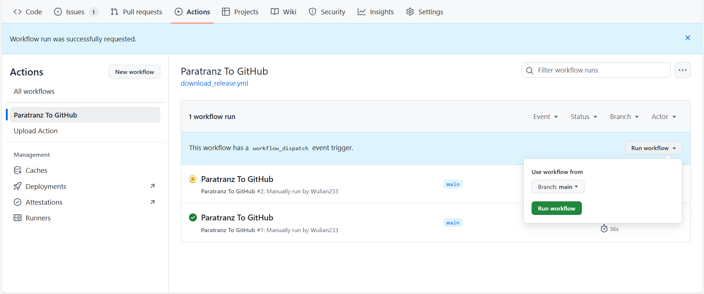

 
   <h1>某某项目简体中文翻译</h1>

| CurseForge     | 加载器     | 整合包版本         | 汉化维护状态 |
| :------------- | :--------- | :----------------- | :----------- |
| [链接](原链接) | 模组加载器 | MC 版本 整合包版本 | 翻译中       |

### 📌 汉化相关

- **汉化项目**：[Paratranz](https://paratranz.cn/projects/项目)
- **汉化发布**：[VM 汉化组官网](https://vmct-cn.top/modpacks/项目)
- **译者名单**：[贡献者排行榜](https://paratranz.cn/projects/项目/leaderboard)

# 📖 整合包介绍

（在这里填写整合包介绍内容……）

# ⚙️ 自动化 Paratranz 同步教程

## 1. 设置环境变量

1. 在仓库顶部导航栏依次进入：
   `Settings -> Environments -> New environment`，新建环境 `PARATRANZ_ENV`。

2. 在该环境中添加 **加密变量（Environment secrets）**：

   | 名称    | 值                                       |
   | ------- | ---------------------------------------- |
   | API_KEY | 你的 Paratranz token，需具备上传文件权限 |

   🔑 Token 可在 [Paratranz 用户设置页](https://paratranz.cn/users/my) 获取。

3. 在该环境中添加 **环境变量（Environment variables）**：

   | 名称 | 值                              |
   | ---- | ------------------------------- |
   | ID   | Paratranz 项目 ID，例如 `10719` |

## 2. 使用说明

我们目前有两个 GitHub Actions 工作流：

- **Paratranz → GitHub**：从 Paratranz 拉取译文至 GitHub 仓库。
- **GitHub → Paratranz**：将原文内容推送到 Paratranz。

> ✅ 两者均支持手动运行，操作如下图所示：

### 自动运行规则

- **Paratranz → GitHub** 会在北京时间 **每天早上与晚上 10 点左右** 自动执行。
- 下载译文至 GitHub 的功能可通过修改 `.github/workflows/download_release.yml` 内的 `cron 表达式` 自行设定执行时间。

📎 参考：[Cron 表达式教程](https://blog.csdn.net/Stromboli/article/details/141962560)

### 发布与检查机制

- 当有译文更改时，工作流会自动发布一个 **预发布 Release** 供测试。
- 每次同步上游后，会运行一次 **FTB 任务颜色字符检查程序**：

  - **发现错误**：在 Release 说明页面提示，并上传 HTML 报告至 **Artifacts** 和 **Release 页面**。
  - **未发现错误**：工作流详情页会提示找不到报告文件，此属正常情况，无需担心。

⚠️ 注意：

- **GitHub → Paratranz** 的同步任务使用频率较低，仅支持手动触发。
- 若项目已完成，请至仓库 **Settings** 中禁用工作流运行。
